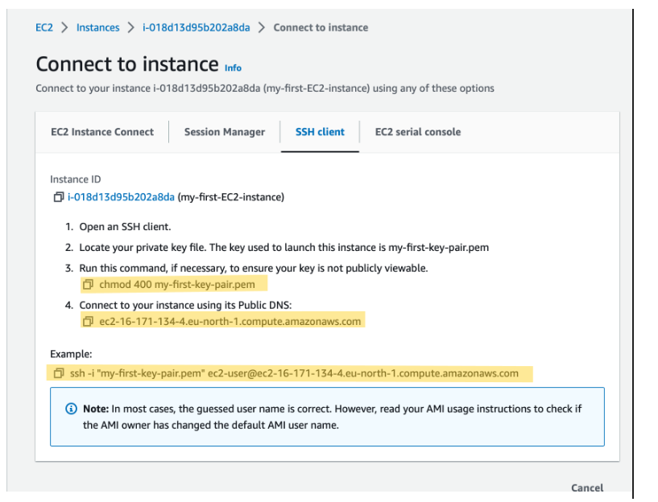

# Pinterest Data Pipeline
Pinterest is a world-class visual discovery platform where users can find ideas or inspirations and share useful contents.

## Table Content
- [Brief Description](#brief-description)
    - [Tools used for the project](#tools-used-for-the-project)
- [Starting to build the Data Pipeline](#starting-to-build-the-data-pipeline)
    - [Setting up AWS Cloud account - Step by Step](#set-up-aws-cloud-account)
    - [Document Download](#document-download)
- [Configuring the EC2 Kafka Client](#configuring-the-ec2-kafka-client)
    - [Creating a Key Pair](#creating-a-key-pair)
    - [Setting up Amazon EC2 Client Machine:](#setting-up-amazon-ec2-client-machine)
    - [Setting up Kafka on EC2 instances](#setting-up-amazon-ec2-client-machine)
    - [Create Kafka topics](#create-kafka-topics)
- [Connecting to MSK cluster to a S3 Bucket](#connecting-to-msk-cluster-to-a-s3-bucket)
    - [Creating a custom plugin with MSK Connect](#creating-a-custom-plugin-with-msk-connect)
    - [Creating a connector with MSK Cluster](#creating-a-connector-with-msk-cluster)
- [Configuring an API in API Gateway](#configuring-an-api-in-api-gateway)
    - [Building a Kafka REST proxy integration method for the API](#building-a-kafka-rest-proxy-integration-method-for-the-api)
    - [Setting up the Kafka REST proxy on the EC2 Client](#setting-up-the-kafka-rest-proxy-on-the-ec2-client)
    - [Sending data to the API](#sending-data-to-the-api)
- [Databricks - Mount a S3 bucket to Databricks](#mount-a-s3-bucket-to-databricks)
- [Spark on Databricks](#spark-on-databricks)
    - [Cleaning & Querying the Dataframes for each of the 3 Tables](#cleaning--querying-the-dataframes-for-each-of-the-3-tables)
- [AWS MWAA - Creating & uploading a DAG to a MWAA environment](#aws-mwaa---creating--uploading-a-dag-to-a-mwaa-environment)
- [Stream Processing: AWS Kinesis](#stream-processing-aws-kinesis)
- [Conclusion](#conclusion)
    
## Brief Description
For this project, the scenario is to create a system that uses the AWS Cloud that will enables the Pinterest to crunch billions of data points each day by running through two separate pipelines - Batch Processing and Stream Processing. 

### Definition of Batch & Stream Processing:
- Batch Processing is where data is aggregated, before being processed all at once in bulk
- Stream Processing is where data is processed as soon as it is ingested into the system

### Tools used for this project :

-   Key Pair - In Amazon EC2, a key pair is a secure method of accessing your EC2 instances. It consists of a public key and a corresponding private key. The public key is used to encrypt data that can only be decrypted using the private key. Key pairs are essential for establishing secure remote access to your EC2 instances.

- Amazon EC2 - is used as an Apache Kafka client machine
    - Amazon Elastic Compute Cloud (EC2) is a key component of Amazon Web Services (AWS) and plays a vital role in cloud computing. EC2 provides a scalable and flexible infrastructure for hosting virtual servers, also known as instances, in the cloud.
- Apache Kafka - Apache Kafka is a relatively new open-source technology for distributed data storage optimised for ingesting and processing streaming data in real-time. Kafka provides 3 main functions:
    1.  Publish and subscribe to streams of records
    1.  Effectively store streams of records in the order in which records were generated
    1.  Process streams of records in real-time

    Kafka is primarily used to build real-time streaming data pipelines and applications that adapt to the data streams. It combines messaging, storage, and stream processing to allow storage and analysis of both historical and real-time data.

- Amazon MSK - Amazon Managed Streaming for Apache Kafka (Amazon MSK) is a fully managed service used to build and run applications that use Apache Kafka to process data. Apache Kafka is an open-source technology for distributed data storage, optimized for ingesting and processing streaming data in real-time.

    Amazon MSK makes it easy for you to build and run production applications on Apache Kafka without needing Apache Kafka infrastructure management expertise. That means you spend less time managing infrastructure and more time building applications.

- AWS MSK Connect - AWS MSK Connect is used to connect the MSK Cluster to a dedicated S3 Bucket, which will automatically save any data that is going through the cluster.

    MSK Connect is a feature of AWS MSK, that allows users to stream data to and from their MSK-hosted Apache Kafka clusters. With MSK Connect, you can deploy fully managed connectors that move data into or pull data from popular data stores like Amazon S3 and Amazon OpenSearch Service, or that connect Kafka clusters with external systems, such as databases and file systems. 

- Amazon S3 - Amazon S3, also known as Simple Storage Service, is a scalable and highly available object storage service provided by AWS. Its primary purpose is to store and retrieve large amounts of data reliably, securely, and cost-effectively.

- API Gateway - Amazon API Gateway is an AWS service that allows the creation, maintenance and securing of scalable REST, HTTP and Websocket APIs. APIs can be created to access AWS services and other web services or data stored in the AWS Cloud. As a developer, you can use the service to create APIs that serve your client's applications or that are available to third-party app developers.

- AWS MWAA - Amazon Managed Workflows for Apache Airflow (MWAA) is a managed service that was designed to help you integrate Apache Airflow straight in the cloud, with minimal setup and the quickest time to execution. Apache Airflow is a tool used to schedule and monitor different sequences of processes and tasks, referred to as workflows.

- AWS Kinesis - AWS Kinesis can collect streaming data such as event logs, social media feeds, application data, and IoT sensor data in real time or near real-time. Kinesis enables you to process and analyze this data as soon as it arrives, allowing you to respond instantly and gain timely analytics insights.

## Starting to build the Data Pipeline

### Set up AWS Cloud account:
For this project an AWS Cloud account must be created to be able to use different services that runs in the AWS Cloud. To create an AWS Cloud account visit the [AWS Website](https://colab.research.google.com/corgiredirector?site=https%3A%2F%2Fconsole.aws.amazon.com%2Fconsole%2Fhome) and click on 'Create a new AWS account'.

#### Step by Step set-up:
1.  Provide your email address - This will be the email address for the root user, who will have full administrative access to the account.
1.  Choose an account name - The account name will be used as a subdomain in the default URL of your AWS resources.
1.  Verification email - Check your email inbox and look for the email from AWS with the subject AWS Email Verification.
1.  Enter the verification code
1.  Set up root user password - Set the password for the root user
1.  Select a support plan - Choose the plan that best fits your needs (e.g Personal)
1.  Enter your payment information - AWS requires this information for billing purposes. You will only be charged for the services you use beyond the AWS Free Tier limits
1.  Confirm your identity - Select the option you prefer and click on Call me now or Send SMS to receive a verification code
1.  Enter the verification code
1. Select a support plan - Select the Basic plan and click on Complete sign up
1. Wait for AWS account activation
1. Access your AWS account

### Document Download
In order to mimic the kind of work that Data Engineers work at Pinterest, this project contained a Python script, [user_posting_emulation.py](user_posting_emulation.py). When running in terminal it executes random data points (as seen below images) for those 3 tables that are received by the Pinterest API when a POST request was made by the user. Below are the 3 tables that was contained in the AWS RDS Database:

-   'pinterest_data' contains data about posts being updated to Pinterest

-   'geolocation_data' contains data about the geolocation of each Pinterest post found in 'pinterest_data'

-   'user_data' contains data about the user that has uploaded each post found in 'pinterest_data'

## Configuring the EC2 Kafka client
Configuring an Amazon EC2 Instance that use Apache Kafka Client Machine will require creating a Key Pair, setting up Amazon EC2 Client Machine, setting up Kafka on EC2 instances and creating a Kafka Topics.

### Creating a Key Pair

To create a new key pair from scratch navigate to EC2 console > Network & Security > Key Pair and top right hand corner click 'Create Key Pair', which will take the user to the below page. Here is where the user will create the new Key Pair. Give the key pair a descriptive name and choose 'RSA' and '.pem' for the file extension name. 

### Setting up Amazon EC2 Client Machine:

In order for the EC2 Client Machine to connect via SSH (Secure Shell), a private key is required that is associated with the Key Pair that is used during the instance launch.

To connect using an SSH client:

1. Ensure you have the private key file (.pem) associated with the key pair used for the instance.

1. Open the terminal in the VSC application. In the terminal an appropriate permission needs to be set for the private key to be only accessible to the owner. Here is the command to set the permission:

        chmod 400 /path/to/private_key.pem

1. Use the SSH command to connect to the EC2 instance, which can be found under the Example in the SSH client tab, if already in the folder where the .pem then no need to specify the filepath name just enter the private_key.pem file

        ssh -i /path/to/private_key.pem ec2-user@public_dns_name

1. When accessing the EC2 Client Machine for the first time it may prompt a message about the authenticity of the host. The reason for this is because the SSH Client does not recognise the remote host and wanted to verify for secure communication. Enter yes to confirm and continue to connect.

1. Once the connection is successful the below image should show to confirm that the user has connected to the EC2 Client Machine

    

### Setting up Kafka on EC2 instances 
Before installing Kafka, a Java packages was needed to be installed first

        sudo yum install java-1.8.0

Downloading Kafka, which has to be the same as MSK Cluster

        wget https://archive.apache.org/dist/kafka/2.8.1/kafka_2.12-2.8.1.tgz

Unpack the .tgz

        tar -xzf kafka_2.12-2.8.1.tgz

Before creating a Kafka topic on client machine additional steps needed to be followed, so that IAM authentication can be connected to cluster

1. Navigate to Kafka installation folder and then in the libs folder download the [IAM MSK authentication](https://github.com/aws/aws-msk-iam-auth/releases/download/v1.1.5/aws-msk-iam-auth-1.1.5-all.jar) package from Github, using the following command:

        wget https://github.com/aws/aws-msk-iam-auth/releases/download/v1.1.5/aws-msk-iam-auth-1.1.5-all.jar

1. Configure the EC2 Client Machine by using AWS IAM for Cluster authentication as this will contains the necessary permissions to authenticate to the MSK cluster:

    -   Navigate to the IAM console
    -   On the left hand side select the Roles section
    -   In this list of roles, select the one with the following format: <your_UserId>-ec2-access-role
    -   Copy role ARN and make a note of it, as it will be used later for the cluster authentication
    -   Go to the Trust relationships tab and select Edit trust policy
    -   Click on the Add a principal button and select IAM roles as the Principal type
    -   Replace ARN with the <UserId>-ec2-access-role

1. Modify the client.properties file, inside the kafka_folder/bin directory by using the code below:

        # Sets up TLS for encryption and SASL for authN.
        security.protocol = SASL_SSL

        # Identifies the SASL mechanism to use.
        sasl.mechanism = AWS_MSK_IAM

        # Binds SASL client implementation.
        sasl.jaas.config = software.amazon.msk.auth.iam.IAMLoginModule required;

        # Encapsulates constructing a SigV4 signature based on extracted credentials.
        # The SASL client bound by "sasl.jaas.config" invokes this class.
        sasl.client.callback.handler.class = software.amazon.msk.auth.iam.IAMClientCallbackHandler

### Create Kafka topics
If the above is set up properly then it is possible to create topics on the Kafka cluster using the client machine command line. The command for creating topics is as follows.

    <path-to-your-kafka-installation>/bin/kafka-topics.sh --create --bootstrap-server <BootstrapServerString> --command-config client.properties --topic <topic name>

The below 3 topics for this project was created. One each for the pinterest_data, geolocation_data, and user_data outlined above.

Also, made sure the CLASSPATH is set up properly by following the below command:

    export CLASSPATH=/home/ec2-user/kafka_2.12-2.8.1/libs/aws-msk-iam-auth-1.1.5-all.jar

## Connecting to MSK cluster to a S3 Bucket

Using MSK Connect to connect the MSK Cluster to a S3 Bucket, will automatically save and store data in the dedicated S3 Bucket.

For the S3 Bucket to work the following steps needed be actioned

### Creating a custom plugin with MSK Connect

For this project the S3 Bucket, IAM role that allows to write to the bucket or VPC Endpoint to S3 was not needed to be created from scratch as it was already created for this project. However, if you were to create from scratch these are the necessary step to take:

Creating the S3 Bucket 
1.  Navagate to the S3 Bucket
1.  Click on 'Create bucket'
1.  Provide the following information:
    - AWS Region: Select the AWS region
    - Bucket Type: Select the type of bucket
    - Bucket Name: Enter unique name
1. Leave the rest of the sections as recommended and default

As the S3 Bucket was already created for this project, I navigated to the S3 Console and entered the 'userid' to find the bucket that was associated witht the 'userId' and made the note for the bucket name, which was in the following format 'user-(your_userid)-bucket' as this will be required in the next step.

Here is where the object of the data will be saved and stored

Next, navigated to the MSK console and selected Customised plugins and clicked on 'Create custom plugin'.

Entered the S3 url as it was described in the search bar 's3://bucket/prefix/object' and customised plugin name was entered in following format '(userId)-plugin'.

### Creating a connector with MSK Cluster

Navigated to MSK console, selected Connectors under the MSK Connect section on the left side of the console. Choosed Create connector.

In the list of plugin, I've entered the following name (userId)-plugin to select the plugin that I've created and then click Next. For the connector name I've entered the following name as (userId)-connector.

In the Connector configuration settings i've copied the following configuration as:

    connector.class=io.confluent.connect.s3.S3SinkConnector
    # same region as our bucket and cluster
    s3.region=us-east-1
    flush.size=1
    schema.compatibility=NONE
    tasks.max=3
    # include nomeclature of topic name, given here as an example will read all data from topic names starting with msk.topic....
    topics.regex=<YOUR_UUID>.*
    format.class=io.confluent.connect.s3.format.json.JsonFormat
    partitioner.class=io.confluent.connect.storage.partitioner.DefaultPartitioner
    value.converter.schemas.enable=false
    value.converter=org.apache.kafka.connect.json.JsonConverter
    storage.class=io.confluent.connect.s3.storage.S3Storage
    key.converter=org.apache.kafka.connect.storage.StringConverter
    s3.bucket.name=<BUCKET_NAME>

## Configuring an API in API Gateway
To replicate the Pinterest Data Pipeline an API needed to be build. So this API will send data to the MSK Cluster, which in turn will be stored in the S3 Bucket using the connector that was build in the previous section.

### Building a Kafka REST proxy integration method for the API

For this project an API has already been created, so no need to create one from scratch. However, if you were to create one from scratch below steps needed:

1. Navigate to API Gateway
1. Click on 'Create API'
1. Select Build on REST API option
1. Under Choose the protocol select REST API
1. Under Create new API select New API
1. Name the API, provide a description and select the Endpoint type for the API - i.e a regional API

After the API is created, the Method page will appear like the one below. Here is where method will be created 

With the API that was already created for this project, the next step was to create the Resource that allowed to build a PROXY integration for the API.

Next step was to create HTTP ANY method with the Endpoint URL

Final step in the API was to Deploy the API, which would create the 'Invoke URL'. To do that was to click on the Action menu and clicked on 'Deploy API' option.

After clicking the Deploy button the Invoke URL should show in the Stage section

### Setting up the Kafka REST proxy on the EC2 Client

After setting up the Kafka REST Proxy integration for the API, now setting up the Kafka REST Proxy on the EC2 client machine.

Firstly, downloaded the Confluent package to set up REST API to communicate with Kafka cluster.

To do that the below command was entered:

    sudo wget https://packages.confluent.io/archive/7.2/confluent-7.2.0.tar.gz

    tar -xvzf confluent-7.2.0.tar.gz  

Next, modifying the kafka-rest.properties file with the below command:

    # Navigating to 
    confluent-7.2.0/etc/kafka-rest
    # modifying the file 
    nano kafka-rest.properties

Inside the kafka-rest.properties the bootstrap.servers and zookeeper.connect was modify with the corresponding Boostrap server string and Plaintext Apache Zookeeper connection string info found in the MSK Cluster section.

Also the below code was added to the kafka-rest.properties:

    # Sets up TLS for encryption and SASL for authN.
    client.security.protocol = SASL_SSL

    # Identifies the SASL mechanism to use.
    client.sasl.mechanism = AWS_MSK_IAM

    # Binds SASL client implementation.
    client.sasl.jaas.config = software.amazon.msk.auth.iam.IAMLoginModule required awsRoleArn="Your Access Role";

    # Encapsulates constructing a SigV4 signature based on extracted credentials.
    # The SASL client bound by "sasl.jaas.config" invokes this class.
    client.sasl.client.callback.handler.class = software.amazon.msk.auth.iam.IAMClientCallbackHandler

After modifying the kafka-rest.properties file, its time to start the REST proxy on the EC2 client machine with the following command:

    # Navigating to the folder
    confluent-7.2.0/bin

    # Starting the REST Proxy
    ./kafka-rest-start /home/ec2-user/confluent-7.2.0/etc/kafka-rest/kafka-rest.properties

This was the output:

### Sending data to the API

Data is ready to be send to the API, which will send the data to the MSK Cluster using the plugin-connector pair

Modified the user_posting_emulation.py that will send data to the Kafka topics by using the API Invoke URL and storing random data points in JSON file

After modifying the user_posting_emulation.py, to run and send the data, the REST Proxy and python file should run at the same time and if the response.code returns 200 from the python file then the data has been sent to the cluster successfully and to see that on the AWS console go to the S3 bucket console > entered the userId in the search bar

## Databricks
Setting up Databricks account that reads data from AWS into Databricks

### Mount a S3 bucket to Databricks
Cleaning and querying the batch data that reads from S3 bucket into Databricks. The file [mount_a_s3_bucket_to_databricks.ipynb](databricks/mount_a_s3_bucket_to_databricks.ipynb) is a notebook that was created in the Databricks application. Below is the step that was taken to carry out the necessary task:

1.  Importing the required libraries
1.  Listing the tables in the Databricks Filestore
1.  Reading the .CSV file type, which contained the access key & secert access key
1.  Mounting the S3 Bucket into the Databricks and making sure that the output return 'True'
1.  Checking if the S3 bucket was mount properly, which the command to run was as follows:
    -   display(dbutils.fs.ls("/mnt/mount_name/../.."))
1.  Reading the JSON format dataset from S3 to Databricks
1.  Unmounting the S3 bucket by using the following command (this was optional):
    -   dbutils.fs.unmount("/mnt/mount_name")

## Spark on Databricks
Performing data cleaning and computations using Spark on Databricks

### Cleaning & Querying the Dataframes for each of the 3 Tables
-   Cleaning Pinterest, Geolocation and User tables by performing necessary action for the relevant required columns for each of the tables. Also rearranging the columns so the columns reflect in the correct order.

    Here is a sample of cleaning the Geolocation table

        # created a new column containing latitude and longitude
        df_geo = df_geo.withColumn("coordinates", array(col("latitude"), col("longitude")))

        # dropping columns
        df_geo = df_geo.drop("latitude", "longitude")

- After cleaning each of the tables, next step was to query the tables such as working out what was the most popular catergory in each country, finding the user with most followers in each country, most popular category for different age group, finding median follower counts of users based on their joining year and age group.

-   Here is a sample of a query that was used to analysis the Tables:

        # Finding user with most follower in each country
        
        df_c_pn_fc = df_pin.join(df_geo, "ind").groupBy(df_geo.country, df_pin.poster_name).agg(first(df_pin.follower_count).alias("follower_count")).orderBy(desc("follower_count"))
        display(df_c_pn_fc)
        
        # country with most user followers

        df_c_fc = df_c_pn_fc.orderBy(desc("follower_count"))
        df_c_fc = df_c_fc.drop("poster_name")
        df_c_fc.show(1)

## AWS MWAA - Creating & uploading a DAG to a MWAA environment
Orchestrating databricks workload on to AWS MWAA platform.
Created a DAG (Directed Acyclic Graph) python file, which will automate the workload that will process the batch information daily using the AWS MWAA platform. By using the Airflow UI it starts to schedule the dag, which will then connect to the Databricks notebook that was created for the batch processing.

## Stream Processing: AWS Kinesis
Sends streaming data to AWS Kinesis and reads data in Databricks, which will then save the data in Delta tables.

### Creating Data streams using Kinesis Data Streams
Used the Kinesis Data Streams to create the 3 required streams

-   streaming-<your_UserId>-pin
-   streaming-<your_UserId>-geo
-   streaming-<your_UserId>-user

### Configuring an API with Kinesis proxy integration
Used similar type of code that invoked the Kafka topic API to this time allow to invoke Kinesis stream API data. 

In the API, the 3 methods were created to enable the API:

-   List streams in Kinesis
-   Create, describe and delete streams in Kinesis
-   Add records to streams in Kinesis

### Sending, Reading, Transforming & Writing data to the Kinesis Streams

-   #### Sending Data
    Created a new script called [user_posting_emulation_streaming.py](user_posting_emulation/user_posting_emulation_streaming.py) to send stream information to their corresponding streams.

-   #### Reading Data
    Created a new notebook in Databricks thats read the credentials to retrieve the Access Key and Secret Access Key.

    Below read method was used to ingest data into Kinesis Data Streams, which should go into the Kinesis Console to see if the Data Streams is receiving the data.

        df = spark \
        .readStream \
        .format('kinesis') \
        .option('streamName','<KINESIS_STREAM_NAME>') \
        .option('initialPosition','earliest') \
        .option('region','us-east-1') \
        .option('awsAccessKey', ACCESS_KEY) \
        .option('awsSecretKey', SECRET_KEY) \
        .load()

-   #### Transforming Data
    Cleaning the data in the same way that was done previously.

-   #### Writing Data
    After the data was cleaned, it was time to save the data in the Delta Tables by using the following code below:

        df.writeStream \
        .format("delta") \
        .outputMode("append") \
        .option("checkpointLocation", "/tmp/kinesis/_checkpoints/") \
        .table("<TABLE_NAME>")

        Streaming Data should be saved in the following tables:
        -   <your_UserId>_pin_table
        -   <your_UserId>_geo_table
        -   <your_UserId>_user_table

## Conclusion
Overall, the pipeline of the data for both Batch and Stream data should work in the similar pattern as below

